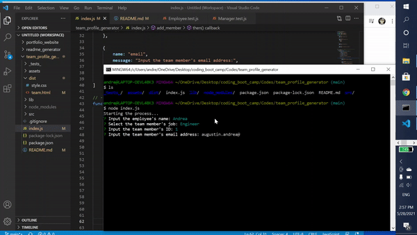
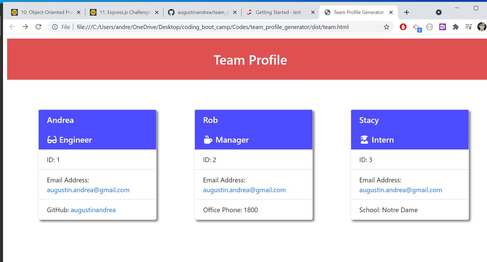
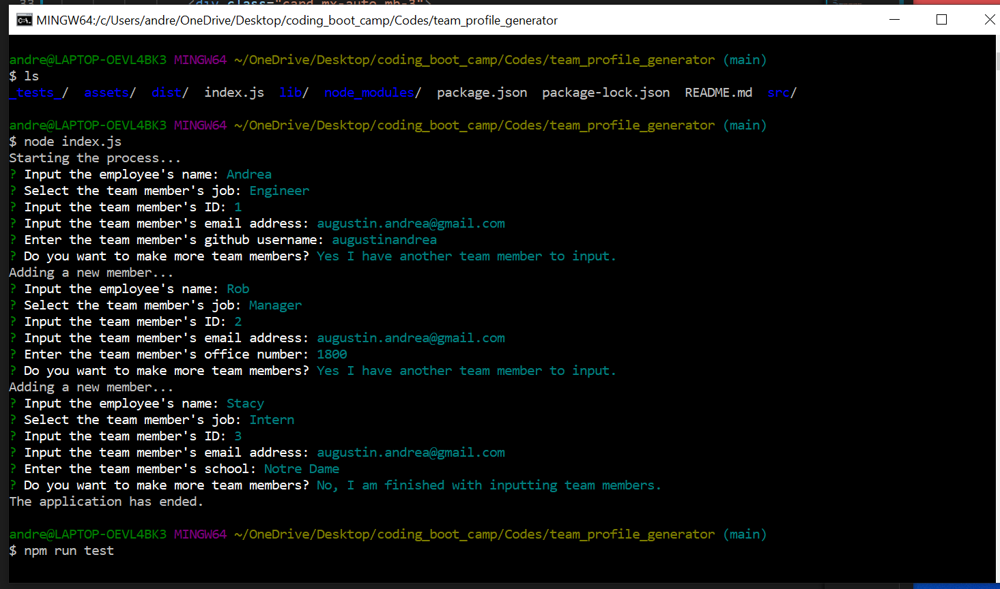
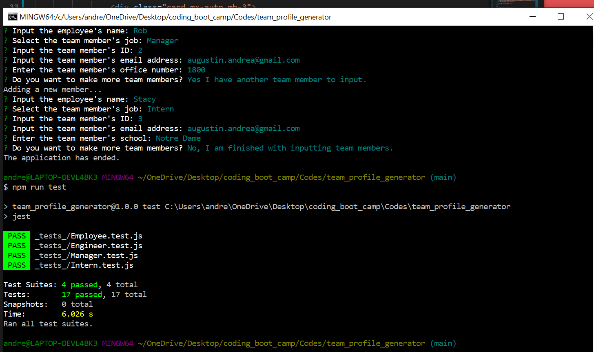

# team_profile_generator

  ## Description
  In this project I created a team profile generator. From the terminal command line, you can start the application and create different cards for each team member. There are different classes for the team members such as Manager, Engineer, and Intern. At the end of the process there will be an outputted HTML and CSS file.
  
 Here is a video showing an example of the process. https://youtu.be/Klhz5vzrFs8

  
  
  

  ## Table of Contents
  * [Description](#Description)
  * [Installation](#Installation)
  * [Usage](#Usage)
  * [Contributing](#Contributing)
  * [Tests](#Tests)
  * [Questions](#Questions)

 
  ## Installation
  Download the repo from GitHub. You may also need to use "npm install".

  ## Usage
  You start the project by going into the terminal, and you type 'node index.js'.

  ## Contributing
  Andrea Augustin

  ## Tests
  I tested the project a couple of times. I used jest testing to test the program.
  Use 'npm run test' to start the testing.

  
  

  
  ## Questions
  If there is any questions on the project, contact me with the email below.

  **GitHub**: [@augustinandrea](https://github.com/augustinandrea)
  

  **Email**: augustin.andrea@gmail.com